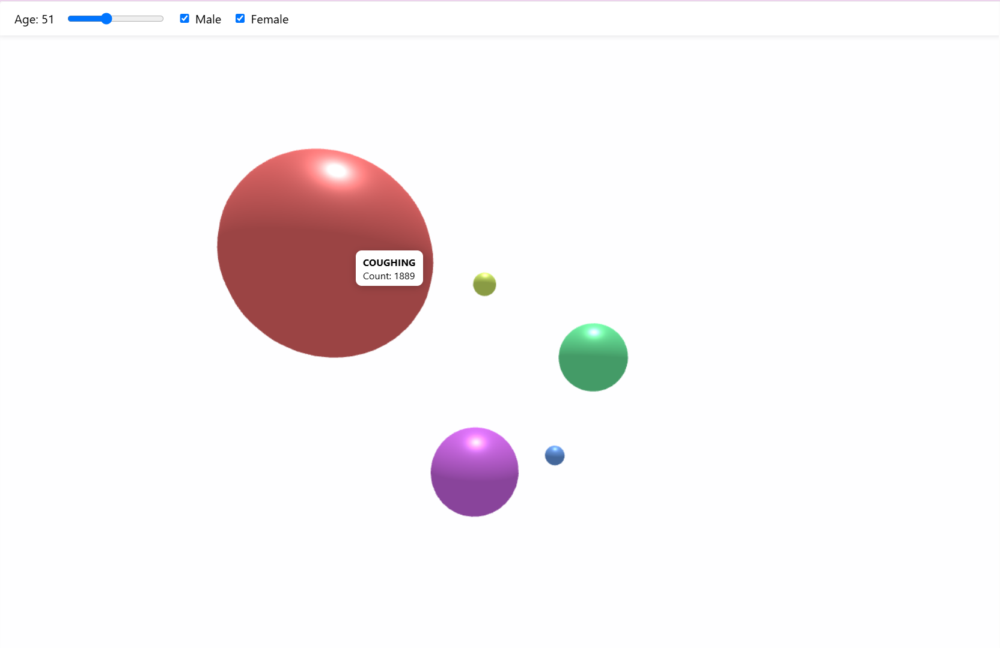
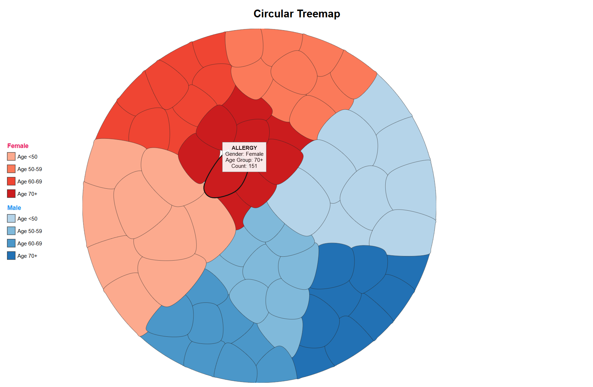
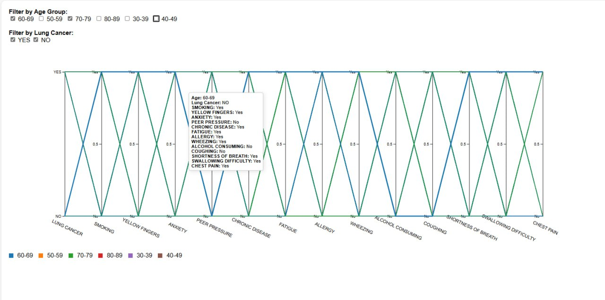
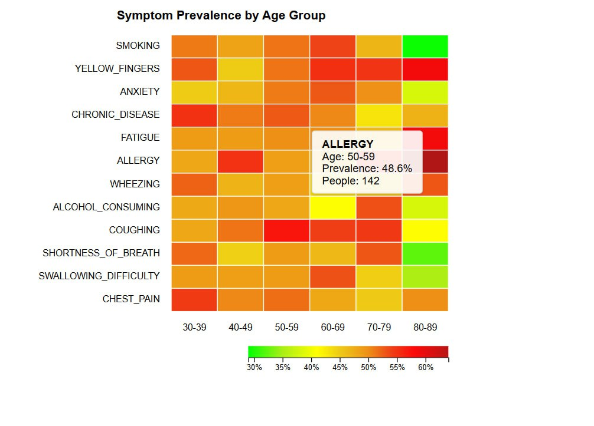
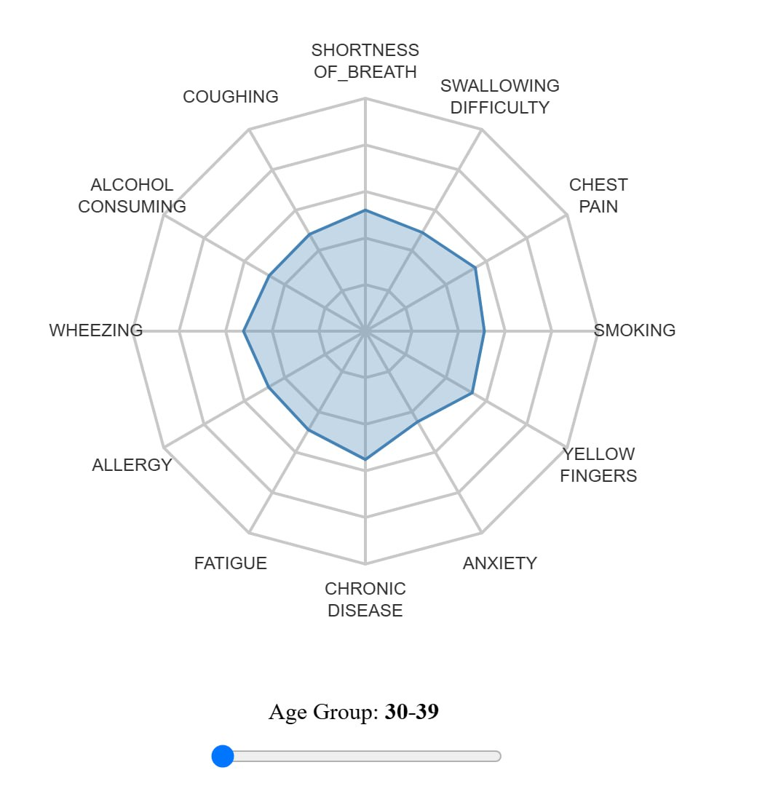
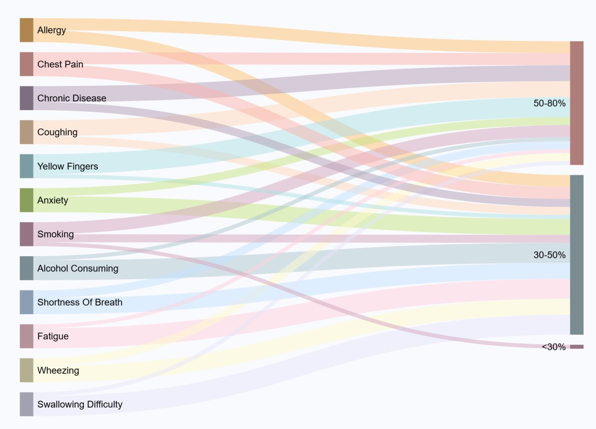
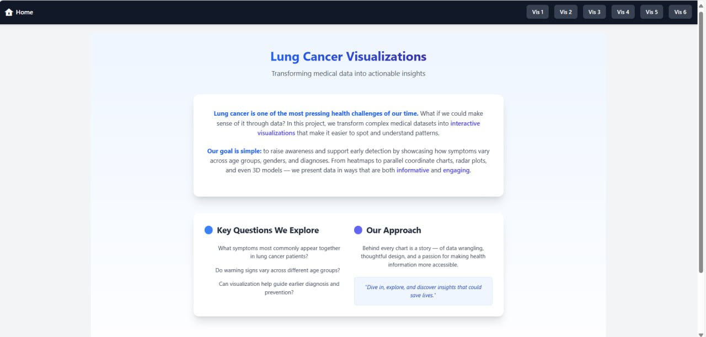
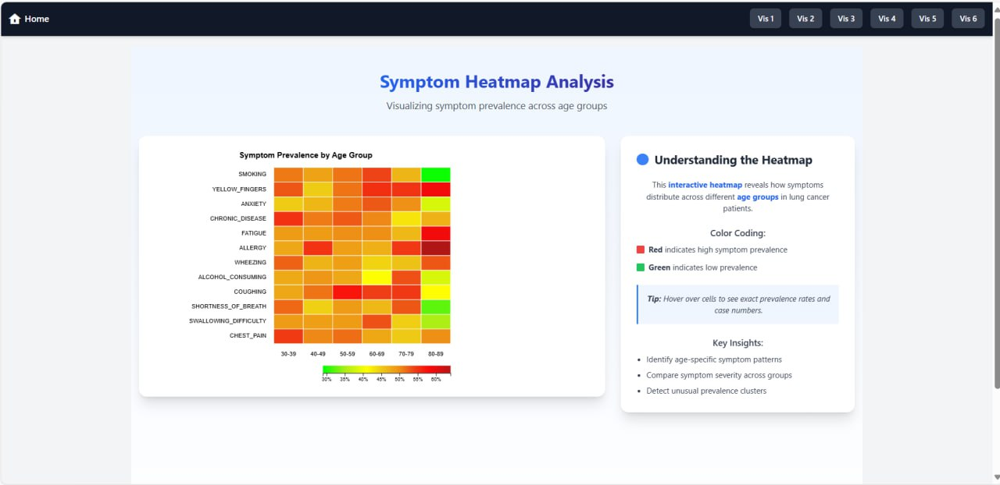

# Lung Cancer Visualization Project

## Live Demo

Check out our deployed project here:  
[Visit the Live Website](https://lungcancer.vercel.app/)

## Project Overview

Lung cancer is a significant global health concern. Early detection and awareness play a crucial role in improving survival rates. This project aims to create six interactive visualizations to analyze the relationship between lung cancer symptoms, age, and gender.

By providing a clear understanding of how lung cancer manifests across demographic groups, we hope to raise awareness and encourage early testing. The visualizations will help answer critical questions such as:

- How do lung cancer symptoms vary across different age groups?
- What patterns can be identified in lung cancer symptoms across all ages?
- What are the main symptoms leading to lung cancer?

## Dataset

We use an external dataset from Kaggle, which provides detailed information on lung cancer symptoms across different age groups and genders.

**Dataset Details:**

- **Demographics:** Gender (M/F), Age (30-80)
- **Symptoms & Risk Factors:** Smoking, alcohol consumption, peer pressure, chronic disease, allergies, anxiety, fatigue, yellow fingers
- **Lung Cancer Presence:** YES/NO
- **Dataset Size:** 3,000 patients (51% diagnosed with lung cancer)

[Dataset Link](https://www.kaggle.com/datasets/akashnath29/lung-cancer-dataset) 

## Technologies Used

- **Frontend:** Vue, Vite
- **Backend:** Flask
- **Visualizations:** D3.js, Three.js
- **Data Processing + EDA:** Pandas, NumPy, Scikit-learn, Matplotlib, Plotly, Seaborn
- **Deployment:** Vercel

## Checkpoints

### Checkpoint 1: Data Preprocessing, EDA & Baseline Frontend

In the first phase of the project, we focused on getting to know our dataset and ensuring it was clean and ready to be visualized. Here's what we did:

- **Preprocessing** the raw Kaggle dataset to remove duplicates, handle missing values, and convert categorical fields.
- **Exploratory Data Analysis (EDA)** to identify patterns, distributions, and outliers.
- **Baseline frontend structure of website**.

### Checkpoint 2:

Our second milestone was all about creating usefull visualizations using D3 and Three.js, here is what we did:

- **3D Bubble Visualization** using `Three.js`.
<p align="center">
  
</p>

- **Circular Treemap** using `D3`.
<p align="center">
  
</p>

- **Parallel Coordinate Chart** using `D3`.
<p align="center">
  
</p>

- **Interactive Heatmap** using `D3`.
<p align="center">
  
</p>

- **Radar Chart** using `D3`.
<p align="center">
  
</p>

- **Sankey Diagram** using `D3`.
<p align="center">
  
</p>

- **Finilized our frontend**
<p align="center">
  
  
</p>

- **Created backend**

- **Deployed our project** using Vercel.

---

### What's Next

- **Perfect the existing visualizations**:  We want to dedicate more time to each of the six visualizations to make them more visually appealing, engaging, and interactive. While the current versions are functional, we believe there's still room to add creative styling, subtle animations, and smoother interactions that make the visual experience more enjoyable and intuitive
- Polish the **GitHub repository** with more thorough documentation and code comments.
- **Add more interactivity + animations**:  We want to make the visualizations more interactive by adding animations, hover effects, and filters that allow users to explore the data in more engaging and personalized ways.

---
### Running the Application

1. Clone the repository:

   ```sh
   git clone https://github.com/Data-Wrangling-and-Visualisation/Lung-Cancer.git
   ```

2. Build and start the Docker containers:

   ```sh
   docker-compose up --build
   ```

3. Access the frontend in your browser by link(you will see it in terminal):
   ```
   http://localhost:5173/
   ```
---
## Contributors

- **Ekaterina Akimenko**
- **Sofia Goryunova**
- **Yasmina Mamadalieva**

## License

This project is licensed under the MIT License.
